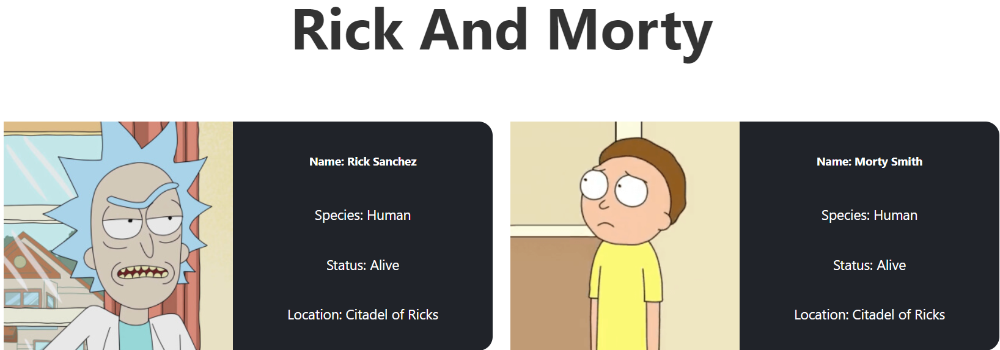
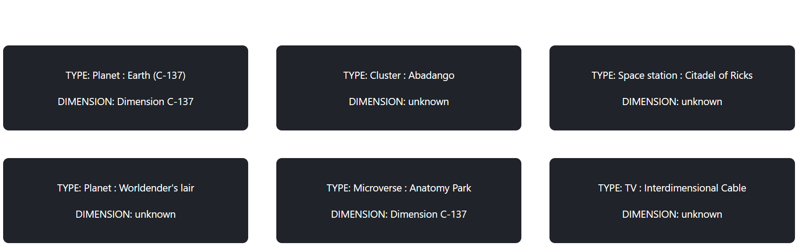
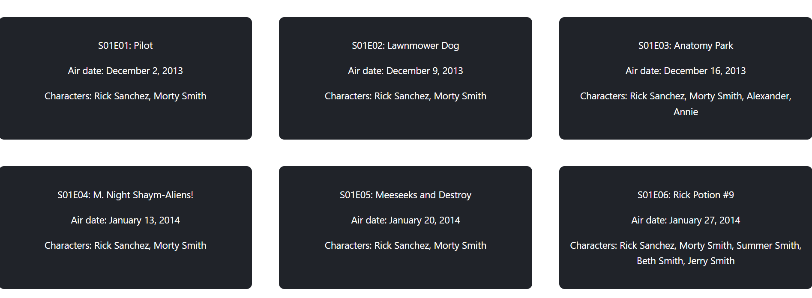

# Rick And Morty API

This project was built using React and plain css

i used [Rick and morty API](https://rickandmortyapi.com/) each component (characters, episode, location) contains the specific

response call.

## Characters:

## Location:

## Episode:

## Running the project

- Clone the project into a directory in your PC.
- Run `npm i` to install the dependencies.
- When the installation is done, open the project by running `npm run start`
